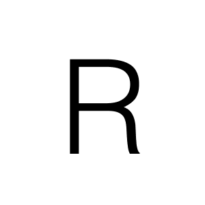

<a id="readme-top"></a>
<br />

<div>
    <div align="center">
        <p>
            
            <h1>Ragnar</h1>
            An open source solution for conducting research and managing  notes with the help of RAG models
        </p>
    </div>
</div>

<details>
    <summary>Table of content</summary>
    <ol>
        <li> <a href="#about-ragnar">About Ragnar</a> </li>
        <ul>
            <li> <a href="#features">Features</a> </li>
            <li> <a href="#build-with">Build with</a> </li>
        </ul>
        <li> <a href="#ragnar-setup-guide">Ragnar Setup Guide </a></li>
        <ul>
            <li> <a href="#how-to-easily-run">How to easily run</a> </li>
            <li> <a href="#important-configure-llm"> Important configure llm</a></li>
        </ul>
        <li>
            <a href="#usage">Usage</a>
            <ul>
                <li> <a href="#important-configure-llm">Important configure LLM</a> </li>
            </ul>
        </li>
        <li>
            <a href="#roadmap"> Roadmap </a>
        </li>
        <li> 
            <a href="#contributing">Contributing</a>
        </li>
        <li>
            <a href="#license">License</a>
        </li>
        <li>
            <a href="#contacts">Contacts</a>
        </li>
        <li>
            <a href="#acknowledgments"> Acknowledgments </a>
        </li>
    </ol>
</details>

# About Ragnar

<!-- [![Contributors][contributors-shield]][contributors-url] -->
<!-- [![Forks][forks-shield]][forks-url] -->
<!-- [![Stargazers][stars-shield]][stars-url] -->
<!-- [![Issues][issues-shield]][issues-url] -->
<!-- [![MIT License][license-shield]][license-url] -->

Ragnar is an innovative open source tool that will help the user clearly understand a bunch of documentation in a couple of minutes. In an era where people need to absorb more and more information in a tight time frame, information overload is becoming a common problem. Ragnar helps reduce the time of searching and understanding information in documents by creating short and clear descriptions of each of them, separating the water from the essence and providing the opportunity to ask the user about this or that information and receive an answer based only on the information in the documents. This function allows you to use the LLM to obtain exactly the information contained in the documents without thinking through the AI.

<p align="right">(<a href="#readme-top">back to top</a>)</p>

## Features

1.	**Document Summarization:** \
Ragnar's main function is to generate short and clear paraphrases of documents. This function is useful for users who work with a large amount of various information or documentation. Ragnar will help such users highlight the main meaning in each document, skipping all unnecessary information, and present it in a user-friendly format.

2.	**Accurate Information Retrieval:** \
Unlike conventional LLMs, which provide answers using previously acquired knowledge, Ragnar guarantees that all answers are obtained strictly from the documents uploaded into it. This is achieved due to the restrictions introduced into the model and pre-written prompts. The user can confidently ask Ragnar questions about the documents, knowing that he will rely only on the information in the documents.
3.	**Open-Source Accessibility:** \
Since Ragnar is an open source project, we welcome collaboration and innovative ideas. Such openness of the application contributes to its greater development and continuous improvement, and it also increases confidence in the functionality of the project. Both users and developers can propose and contribute their ideas for improvement, thereby expanding the functionality of the project.
4.	**User-Friendly Interface:** \
Ragnar is designed to be simple and straightforward to use. Its user-friendly interface allows the user to easily download documents and ask questions about them. The simple design makes the application accessible to all users.

## Build with

[![Svelte][Svelte.dev]][Svelte-url]
[![Python][Python]][Python-url]
[![TypeScript][TypeScript]][TypeScript-url]
[![Shell][Shell]][Shell-url]
[![Css][Css]][Css-url]
[![Docker][Docker]][Docker-url]

# Getting Started

Welcome to Ragnar MVP-v2! This guide will walk you through cloning the repository and starting the application using Docker.

<p align="right">(<a href="#readme-top">back to top</a>)</p>

## How to easily run:

### Without Olama app

1. Unzip release files
2. Ensure you have Docker installed and running on your machine
3. Open terminal
4. In terminal type:

    4.1.
    ```sh
    cd <path-to-release-folder>
    ```
    4.2.
    ```sh
    docker compose up -d
    ```
5. Go to http://localhost:5173 
6. Wait a little bit, it may take some time to start the app (Around 5 minutes, you can track the progress in Ragnar container in docker, if there are lines 

" Loading WEBUI_SECRET_KEY from file, not provided as an environment variable.

Generating WEBUI_SECRET_KEY

Loading WEBUI_SECRET_KEY from .webui_secret_key "

then the app is starting normally)

7. When the logo of Ragnar appears on the page, the app is running

### With Ollama app

1. Download [Ollama](https://ollama.com) from official site 
2. Run in terminal command to download LLM:
    ``` sh
    ollama run NAME_OF_THE_MODEL
    ```
    in our case:
    ``` sh
    ollama run phi3:mini
    ```
3. Ensure you have Docker installed and running on your machine
4. When instalation will be succesfully ended run next command in terminal
   ```sh
   docker run -d -p 3000:8080 --add-host=host.docker.internal:host-gateway -v ragnar:/app/backend/data --name ragnar --restart always brainpumpkin/ragnar:latest
   ```
5. Enjoy using ragnar
6. For next runnnings you will need run ollama ([step 2](#with-ollama-app)) and run docker container ([step 4](#with-ollama-app))

<p align="right">(<a href="#readme-top">back to top</a>)</p>

# Usage

### Important! Configure LLM:
To start chatting with LLM we recomend to use phi3:mini model, you can set it up by clicking arrow-down icon to the right of "Select a model" label in the top-left corner of the chat window. Then type ```phi3:mini``` and press "Pull phi3:mini from Ollama.com". For this step you will need Internet connection but when the model is downloaded the app does not need Internet connection.


Congratulations! You have successfully started Ragnar. 

<p align="right">(<a href="#readme-top">back to top</a>)</p>

# Roadmap

<p align="right">(<a href="#readme-top">back to top</a>)</p>

# Contributing

<p align="right">(<a href="#readme-top">back to top</a>)</p>

# License

<p align="right">(<a href="#readme-top">back to top</a>)</p>

# Contacts

Mikhail Trifonov – Backend Developer: [GitLab](https://gitlab.pg.innopolis.university/m.trifonov)\
Artyom Grishin – ML-engineer: [GitLab](https://gitlab.pg.innopolis.university/ar.grishin)\
Savva Ponomarev – DevOps-engineer: [GitLab](https://gitlab.pg.innopolis.university/s.ponomarev)\
Ilsaf Abdulkhakov – Frontend Web Developer, UX/UI Designer: [GitLab](https://gitlab.pg.innopolis.university/i.abdulkhakov)\
Azalia Alisheva – Backend Developer: [GitLab](https://gitlab.pg.innopolis.university/a.alisheva)


Project Link: [Ragnar](https://gitlab.pg.innopolis.university/m.trifonov/ragnar/-/tree/main?ref_type=heads)

<p align="right">(<a href="#readme-top">back to top</a>)</p>

# Acknowledgments

<p align="right">(<a href="#readme-top">back to top</a>)</p>

<!-- MARKDOWN LINKS & IMAGES -->

[Svelte.dev]: https://img.shields.io/badge/Svelte-4A4A55?style=for-the-badge&logo=svelte&logoColor=FF3E00
[Svelte-url]: https://svelte.dev/

[Python]: https://img.shields.io/badge/python-3670A0?style=for-the-badge&logo=python&logoColor=ffdd54
[Python-url]: https://www.python.org

[TypeScript]: https://img.shields.io/badge/typescript-%23007ACC.svg?style=for-the-badge&logo=typescript&logoColor=white
[TypeScript-url]: https://www.typescriptlang.org

[Shell]: https://img.shields.io/badge/PowerShell-%235391FE.svg?style=for-the-badge&logo=powershell&logoColor=white
[Shell-url]: https://www.powershellgallery.com

[Css]: https://img.shields.io/badge/css3-%231572B6.svg?style=for-the-badge&logo=css3&logoColor=white
[Css-url]: https://www.w3.org/Style/CSS/Overview.en.html

[Docker]: https://img.shields.io/badge/docker-%230db7ed.svg?style=for-the-badge&logo=docker&logoColor=white
[Docker-url]: https://www.docker.com

[contributors-shield]: https://img.shields.io/github/contributors/othneildrew/Best-README-Template.svg?style=for-the-badge
<!-- [contributors-url] -->
[forks-shield]: https://img.shields.io/github/forks/othneildrew/Best-README-Template.svg?style=for-the-badge
[forks-url]: https://github.com/othneildrew/Best-README-Template/network/members
[stars-shield]: https://img.shields.io/github/stars/othneildrew/Best-README-Template.svg?style=for-the-badge
[stars-url]: https://github.com/othneildrew/Best-README-Template/stargazers
[issues-shield]: https://img.shields.io/gitlab/issues-raw/gitlab.pg.innopolis.university/m.trifonov/ragnar
[issues-url]: https://gitlab.pg.innopolis.university/m.trifonov/ragnar/-/issues
[license-shield]: https://img.shields.io/github/license/othneildrew/Best-README-Template.svg?style=for-the-badge
[license-url]: https://github.com/othneildrew/Best-README-Template/blob/master/LICENSE.txt
[product-screenshot]: images/screenshot.png
